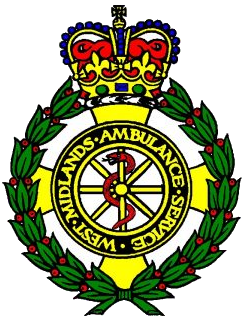
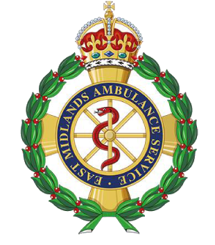

This guide covers the basics for crews using Resusci-Time on a phone or tablet.

## 1. Choose your build

From the [home page](../../), open the version for your service:

| Build | When to use |
| --- | --- |
| **Standard** | Generic adult cardiac arrest protocol — shared options only, no trust-specific extras |
| **WMAS** | West Midlands — includes Code Shock reminder and WMAS branding |
| **EMAS** | East Midlands — EMAS branding; trust-specific medication options can be enabled |

Bookmark that URL so you can open it quickly from the home screen.

### Custom versions on request

The **Standard** build is the baseline for any ambulance service. **Custom versions** are available on request — for example:

- Service crest or logo as the app background
- Trust-specific reminders (such as Code Shock)
- Additional medication buttons
- Other protocol-aligned options agreed with your clinical team

Contact the project maintainer to discuss a build for your trust.

<figure>
  
  <figcaption>Example: WMAS build with trust crest branding</figcaption>
</figure>

<figure>
  
  <figcaption>Example: EMAS build with trust crest branding</figcaption>
</figure>

## 2. What the Standard build includes

The Standard version provides the full core arrest workflow without trust-only extras:

**Timer and protocol**

- Elapsed timer with rhythm-check, adrenaline, and amiodarone reminders
- Shockable rhythm flow with energy selection and shock logging
- Non-shockable rhythm support (PEA / asystole)
- Reversible causes checklist (4 Hs and 4 Ts)
- Early transfer and vector-change prompts where applicable

**Interventions menu**

| Section | Options |
| --- | --- |
| Vascular access | IO or IV (22g–14g) |
| Airway | Head tilt / jaw thrust, OPA, NPA, SGA (i-gel), ET, Needle cric., Suction, Tracheostomy |
| Breathing | BVM, Mechanical vent. (logs oxygen automatically) |
| Circulation | Thoracotomy, Mechanical compressions |
| Medications | Sodium chloride (flush / 250 ml / 500 ml), 10% glucose, Naloxone, plus free-text **Other** |

Saved “Other” entries reappear for quick re-use during the same case.

**End of case**

- **ROSC** — post-ROSC monitoring reminders
- **Termination of resuscitation (TOR)** — structured review
- **Verification of death (VoD)** — separate flow with observation criteria where applicable

**Event log**

- Timestamped log of actions
- **Export** to CSV or PDF
- **Share** via link or QR code
- **Save on device** for later review
- Autosave offers to restore an interrupted case

**App features**

- Install as an app (PWA) on supported phones and tablets
- Day / night theme
- Works offline after first load

Trust builds add features on top of this list — for example, WMAS includes a **Code Shock** reminder after three shocks.

## 3. Install on your device (optional)

On **Chrome** or **Edge**, use **Install app** (or **Add to Home screen** on mobile). The timer then opens full-screen like a native app. You need **HTTPS** — the live site or a local preview build, not plain HTTP on a LAN address for some features.

## 4. Start a case

1. Confirm **patient details** if prompted.
2. Select the **initial rhythm** (VF/pVT, PEA, or Asystole).
3. The **timer bar** shows elapsed time and upcoming actions (rhythm check, adrenaline, etc.).

Tap buttons on the timer bar when you complete actions — they are logged with a timestamp.

## 5. During the arrest

- **Rhythm checks** — log each check; the app tracks the 2-minute cycle.
- **Shocks** — for shockable rhythms, use the shock panel and energy selection.
- **Reversible causes** — open the 4 Hs and 4 Ts checklist; tick causes as you address them (you can untick if needed).
- **Interventions** — open the menu for vascular access, airway, breathing, circulation, and medications.

## 6. ROSC, termination, or VoD

See **End of case** above. Follow the on-screen flow that matches your clinical decision.

## 7. After the case

Use the **event log** panel to export, share, or save the record. Autosave keeps a draft on the device if you leave mid-case — you will be offered a restore when you return.

## Tips

- Run through a **training case** before first live use if your build shows a preview or test banner.
- Keep screen brightness up and **Do Not Disturb** on if possible.
- The app supports **day/night** theme from the header toggle.

More guides will be added here as features grow. If you spot a bug, need a custom trust build, or have a feature idea, contact your local clinical lead or the project maintainer.
