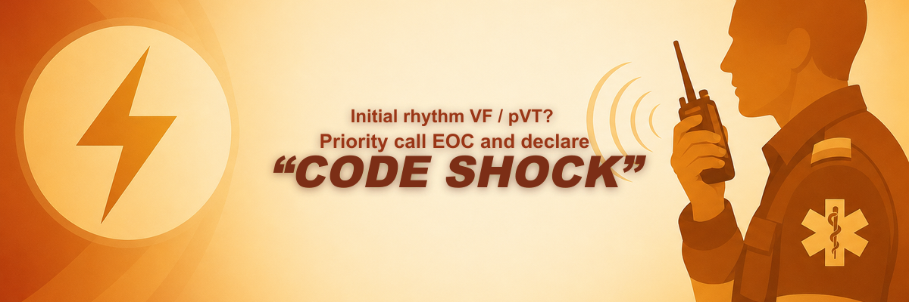

The **WMAS build** of Resusci-Time includes a **CODE SHOCK** reminder. It appears after the **first logged shock** when the **initial rhythm was VF / pVT**, prompting the crew to **inform EOC** that a CODE SHOCK situation exists.

## Why it matters

Shockable cardiac arrest may benefit from **early coordination with EOC** and the **possible deployment of specialist clinicians** to the scene or to support remote clinical decision-making. Notifying EOC at the right time helps the wider system respond sooner, which can lead to **better patient outcomes**.

The reminder is a **prompt only** — it does not replace local WMAS policy, crew judgement, or direct communication with EOC. It is there so the notification step is less likely to be missed under pressure.

## What you will see in the app

1. Commence resuscitation with **VF / pVT** as the initial rhythm and **log the first shock** in Resusci-Time.
2. After that shock is recorded, an **amber alert panel** appears below the timer with the message:

   **CODE SHOCK notified to EOC**

3. Once you have **notified EOC**, tap **Acknowledge**. The app adds a timestamped line to the **event log** (`CODE SHOCK notified to EOC`) so the record reflects that the step was completed.

The panel stays visible until acknowledged. It does not block other actions on screen.

## WMAS build only

This reminder is **enabled only in the WMAS custom build** (live and preview URLs for West Midlands crews). The Standard build and other trust builds do not show CODE SHOCK.

Open the WMAS app from your service link or bookmark — see your local Resusci-Time rollout contact if you need the URL.

## Training tip

Run through a **preview** or training case with **VF / pVT** as the initial rhythm and log the **first shock** to see the panel and acknowledgement flow before you rely on it on a real job. It does **not** appear if the first monitored rhythm was PEA or asystole, even if the patient is shocked later. The preview build also lets you change protocol speed (1×–10×) from the header if you want a quicker walkthrough.

## Feedback

If the wording, timing, or placement of this reminder should change to fit WMAS practice better, pass feedback to your clinical lead or the project maintainer.
