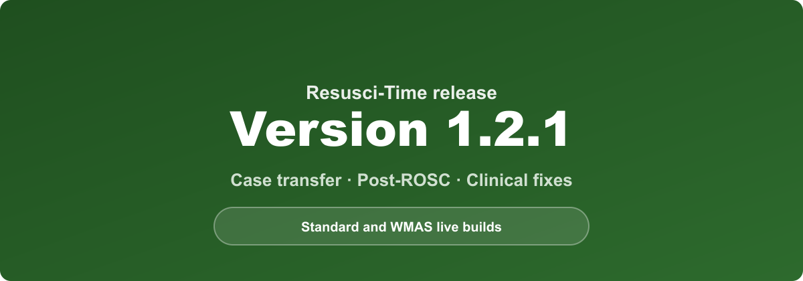
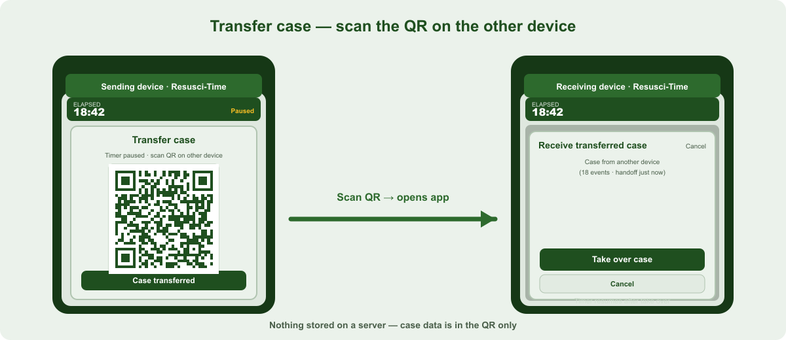
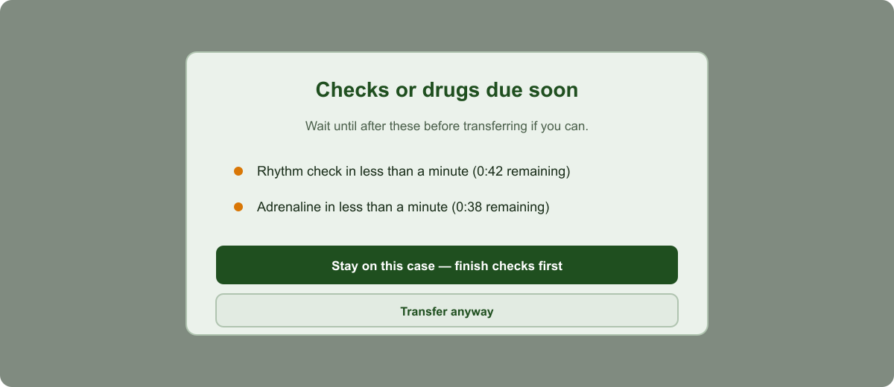
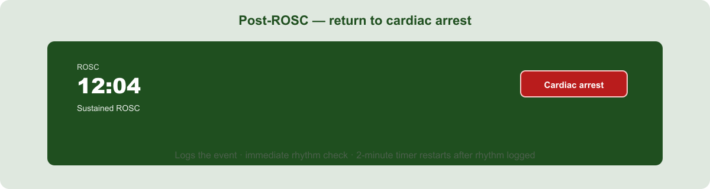

Versions **1.2.0** and **1.2.1** are rolling out on the **Standard** and **WMAS live** builds of Resusci-Time. Together they add **case transfer between devices**, safer handoff when checks are due, a clearer **re-arrest** path during post-ROSC care, and several **clinical fixes** around monitoring and termination.

## Transfer case to another device (1.2.0)

When crew members need to hand the running case to a second phone or tablet — for example when swapping roles or moving to the ambulance — use **Transfer case** in the header during active resuscitation.

1. **Transfer case** **pauses the timer** on this device and shows a **QR code**.
2. The other device scans the code and is prompted **Take over case** (with a warning if a case is already in progress).
3. When the receiving device has the case, tap **Case transferred** here — this device becomes **read-only** and the log closes.
4. Tap **Resume case** if the transfer does not complete — the timer resumes on this device.

Case data is encoded in the QR **only** — **nothing is stored on a server**. Very long cases may exceed QR capacity; the app warns you to continue on this device instead.

The **Case transferred** banner clears when you start a new case or return to the start screen. **Start new case on this device** on the banner clears read-only state locally.

## Checks due before you transfer (1.2.1)

If you tap **Transfer case** when a **rhythm check** or **repeat adrenaline** is due within a minute, a warning appears first:

- Lists what is imminent (for example rhythm check or adrenaline due now, or in less than a minute).
- **Stay on this case — finish checks first** — closes the warning so you can complete the step.
- **Transfer anyway** — continues to the QR handoff if you still need to transfer.

This reduces the chance of handing over mid-check without the crew noticing.

## Post-ROSC — return to cardiac arrest (1.2.1)

During post-ROSC care the timer bar shows a red **Cardiac arrest** button (mirroring the green **ROSC** button used during arrest).

When the patient returns to cardiac arrest:

1. Tap **Cardiac arrest** — the event is **logged**, and the app returns to **arrest mode**.
2. An **immediate rhythm check** opens — select the current monitored rhythm (or ROSC if output returns).
3. After the rhythm is logged, the **2-minute rhythm check timer** restarts from that point.

You no longer need to wait for a scheduled rhythm check or rely on an indirect route back to resuscitation mode.

## Sustained ROSC — alert and termination (fixes in 1.2.1)

When post-ROSC care reaches **more than 10 minutes with output**:

- The event is **recorded in the log** and an **amber alert** appears (acknowledge to dismiss).
- The alert notes that **senior clinical discussion would be required** should the patient return to cardiac arrest before any cessation of resuscitation.
- If the patient **re-arrests** and you open **termination of resuscitation (TOR)**, a **senior clinical discussion** step appears **first** — the same pattern as **prolonged VF/pVT on the WMAS build** (see below).

The sustained ROSC clock and log entry now run reliably throughout post-ROSC care.

## Other fixes (1.2.1)

**Post-ROSC SBP and pulse reminders**

- Button labels, colours, and logging for **adequate vs inadequate** SBP and pulse were corrected (they had been reversed).
- The **pulse** reminder waits until the **SBP** step is completed.

**Early transfer reminder**

- The “consider early transfer” prompt no longer appears after **ROSC and re-arrest** (it would not be appropriate in that context).

**Copy**

- User-facing text uses plain words (for example “60 bpm and above”) instead of `<` / `>` symbols.

## WMAS build — prolonged VF at TOR (unchanged, for context)

The **WMAS** build still includes **CODE SHOCK** after the first shock and the **prolonged VF** TOR gate if `Prolonged VF` was logged during the case. Those features are **not** on the Standard build.

**Sustained ROSC at TOR** (above) applies on **all** builds once sustained ROSC has been achieved in the case.

See also: [CODE SHOCK reminder for WMAS crews](./2026-05-31-wmas-code-shock-reminder.html).

## Training tip

Custom trust **preview** URLs remain available for walk-throughs with DEMO icons and optional **preview speed** (1×–10×). Live field builds always run at real time and do not show the preview startup warning.

Practice **Transfer case** and the **Cardiac arrest** button on a training case before relying on them on a real job.

## Feedback

If any wording, timing, or placement should better match clinical practice, pass feedback to your clinical lead or the project maintainer.
